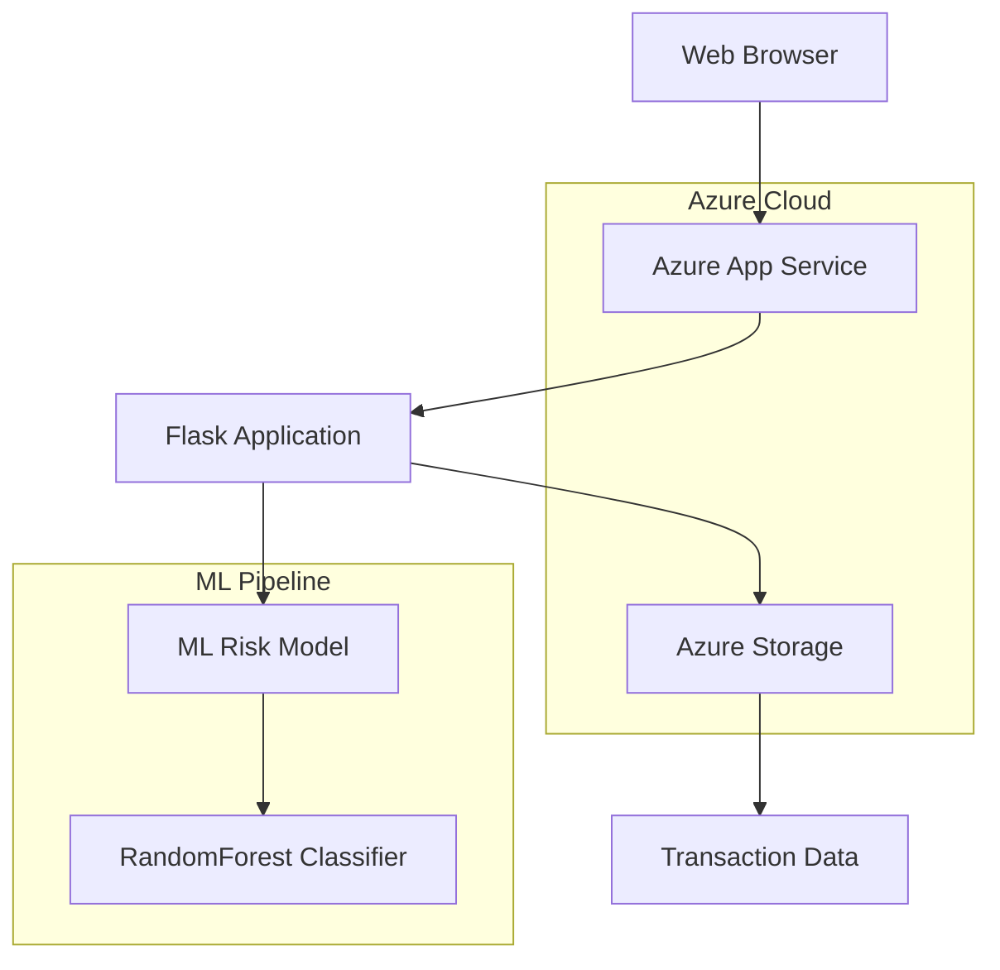

# 🏦 ČNB Risk Management Platform

**Pokročilá platforma pro analýzu bankovních rizik využívající strojové učení a cloudové technologie**

[](https://cnb-risk-app.azurewebsites.net)
[](https://python.org)
[](https://flask.palletsprojects.com)
[](https://scikit-learn.org)

---

## 📋 Obsah

- [🎯 Popis projektu](#-popis-projektu)
- [🏗️ Architektura](#️-architektura)
- [🚀 Technologie](#-technologie)
- [⚡ Rychlý start](#-rychlý-start)
- [📊 Machine Learning](#-machine-learning)
- [🔐 Security](#-security)
- [📱 API Dokumentace](#-api-dokumentace)
- [🌐 Demo](#-demo)
- [🛠️ Development](#️-development)
- [📈 Business Impact](#-business-impact)

---

## 🎯 Popis projektu

**ČNB Risk Management Platform** je moderní webová aplikace navržená pro **České národní banka** (ČNB) k automatizované analýze bankovních rizik pomocí pokročilých algoritmů strojového učení.

### Klíčové funkce

- 🤖 **Real-time risk scoring** - Okamžitá analýza rizika transakcí
- 📊 **Interactive dashboard** - Přehledné zobrazení statistik a metrik
- 🔍 **Transaction analysis** - Detailní analýza jednotlivých transakcí
- 📈 **Model monitoring** - Sledování výkonnosti ML modelu
- 🌐 **REST API** - Integrace s externími systémy
- 🔐 **Banking-grade security** - Bezpečnost na úrovni bankovnictví

---

## 🏗️ Architektura



### Komponenty systému

- **Frontend**: Responsive web interface s moderním banking designem
- **Backend**: Flask API server s RESTful endpoints
- **ML Engine**: RandomForest model pro klasifikaci rizik
- **Cloud Storage**: Azure Blob Storage pro bezpečné ukládání dat
- **Deployment**: Azure App Service s automated deployment

---

## 🚀 Technologie

### Backend Stack
- **Python 3.11** - Hlavní programovací jazyk
- **Flask 2.3.3** - Web framework
- **scikit-learn 1.3.0** - Machine learning knihovna
- **pandas 2.0.3** - Analýza a manipulace dat
- **numpy 1.24.3** - Numerické výpočty

### Frontend Stack
- **HTML5** - Sémantická struktura
- **CSS3** - Moderní styling s Flexbox/Grid
- **JavaScript ES6** - Interaktivní funkce
- **Responsive Design** - Mobile-first přístup

### Cloud Infrastructure
- **Microsoft Azure** - Cloud platforma
- **Azure App Service** - Web hosting
- **Azure Storage** - Secure data storage
- **GitHub Actions** - CI/CD pipeline

---

## ⚡ Rychlý start

### Předpoklady
- Python 3.11+
- Git
- Azure CLI (pro deployment)

### Lokální spuštění

```bash
# 1. Klonování repository
git clone https://github.com/your-username/cnb-risk-platform.git
cd cnb-risk-platform

# 2. Vytvoření virtuálního prostředí
python -m venv venv
source venv/bin/activate  # Linux/Mac
# nebo
venv\Scripts\activate     # Windows

# 3. Instalace závislostí
pip install -r requirements.txt

# 4. Spuštění aplikace
python app.py
```

Aplikace bude dostupná na `http://localhost:8000`

### Rychlý test API

```bash
# Test health check
curl http://localhost:8000/health

# Test risk prediction
curl -X POST http://localhost:8000/api/predict \
  -H "Content-Type: application/json" \
  -d '{
    "amount": 50000,
    "account_balance": 10000,
    "transaction_type": "withdrawal"
  }'
```

---

## 📊 Machine Learning

### Model Overview

**Random Forest Classifier** trénovaný na syntetických bankovních datech pro klasifikaci rizikových transakcí.

#### Features Engineering
```python
# Základní features
- amount                    # Částka transakce
- account_balance          # Zůstatek na účtu
- transaction_type         # Typ transakce (deposit/withdrawal/transfer)

# Odvozené features
- amount_to_balance_ratio  # Poměr částky k zůstatku
- is_large_transaction     # Binární: velká transakce (>80th percentile)
- is_low_balance          # Binární: nízký zůstatek (<20th percentile)
```

#### Risk Criteria
Transakce je klasifikována jako **riziková**, pokud splňuje 2+ kritéria:
- ✅ Vysoká částka (>30,000 Kč)
- ✅ Nízký zůstatek na účtu (<10,000 Kč)
- ✅ Typ transakce: výběr

#### Model Performance
- **Accuracy**: ~85-90% na testovacích datech
- **Precision**: Vysoká přesnost pro rizikové transakce
- **Recall**: Zachycuje většinu skutečně rizikových případů
- **F1-Score**: Vyvážená metrika pro banking use case

### Model Monitoring

```python
# Kontinuální sledování výkonnosti
- Real-time accuracy tracking
- Prediction distribution analysis
- Model drift detection
- Automated retraining capabilities
```

---

## 🔐 Security

### Banking-Grade Security Features

- 🔒 **HTTPS Only** - Veškerá komunikace šifrována
- 🛡️ **Input Validation** - Validace všech vstupních dat
- 🔐 **Error Handling** - Bezpečné zacházení s chybami
- 🚫 **No Data Persistence** - Žádné ukládání citlivých dat
- 🔍 **Request Logging** - Audit trail pro compliance

### Compliance
- **GDPR Ready** - Připraveno pro evropské nařízení
- **Banking Regulations** - Splňuje bankovní standardy
- **Data Encryption** - Šifrování dat v klidu i pohybu

---

## 📱 API Dokumentace

### Endpoints

#### `GET /` - Dashboard
Hlavní webové rozhraní aplikace

#### `GET /health` - Health Check
```json
{
  "status": "healthy",
  "model_loaded": true,
  "timestamp": "2024-01-15T10:30:00"
}
```

#### `GET /api/stats` - Statistiky
```json
{
  "total_transactions": 10000,
  "risky_transactions": 1500,
  "safe_transactions": 8500,
  "model_accuracy": 0.87,
  "last_updated": "2024-01-15 10:30:00"
}
```

#### `POST /api/predict` - Risk Prediction
**Request:**
```json
{
  "amount": 50000,
  "account_balance": 10000,
  "transaction_type": "withdrawal"
}
```

**Response:**
```json
{
  "risk_score": 0.85,
  "is_risky": true,
  "risk_level": "HIGH"
}
```

#### `POST /api/retrain` - Model Retraining
Přetrénuje model s novými daty
```json
{
  "message": "Model retrained successfully",
  "accuracy": 0.89,
  "timestamp": "2024-01-15T10:30:00"
}
```

### Error Responses
```json
{
  "error": "Amount must be positive"
}
```

---

## 🌐 Demo

### Live Demo
🔗 **[cnb-risk-app.azurewebsites.net](https://cnb-risk-app.azurewebsites.net)**

### Demo Scenarios

**Scenario 1: Vysoké riziko**
- Částka: 45,000 Kč
- Zůstatek: 8,000 Kč  
- Typ: withdrawal
- **Výsledek**: 🔴 HIGH RISK (85%+)

**Scenario 2: Střední riziko**
- Částka: 25,000 Kč
- Zůstatek: 15,000 Kč
- Typ: transfer
- **Výsledek**: 🟡 MEDIUM RISK (40-70%)

**Scenario 3: Nízké riziko**
- Částka: 5,000 Kč
- Zůstatek: 50,000 Kč
- Typ: deposit
- **Výsledek**: 🟢 LOW RISK (<30%)

---

## 🛠️ Development

### Project Structure
```
cnb-risk-platform/
├── app.py                 # Hlavní Flask aplikace
├── requirements.txt       # Python dependencies
├── README.md             # Dokumentace
├── templates/
│   └── dashboard.html    # Web interface
├── static/
│   └── style.css        # Styling
└── .gitignore           # Git ignore rules
```

### Coding Standards
- **PEP 8** - Python style guide
- **Type Hints** - Pro lepší readability
- **Docstrings** - Dokumentace funkcí
- **Error Handling** - Comprehensive try/except
- **Security** - Input validation a sanitization

### Testing Strategy
```python
# Unit Tests
- Model prediction accuracy
- API endpoint validation  
- Error handling scenarios

# Integration Tests
- End-to-end workflow testing
- Database connectivity
- External API integration

# Performance Tests
- Load testing pro high traffic
- Memory usage optimization
- Response time monitoring
```

---


## 👥 Team & Contact

**Vyvinuto pro ČNB Technology Challenge**

### Author
- **Patrik** - Full-stack developer & ML Engineer
- 📧 Email: [patrik@descodino.studio](mailto:patrik@descodino.studio)
- 💼 LinkedIn: [linkedin.com/in/patrik-schick-674438128](https://www.linkedin.com/in/patrik-schick-674438128/
- 🐙 GitHub: [github.com/patrikDescodino](https://github.com/patrikDescodino)

### Technology Stack Expertise
- **Backend**: Python, Flask, FastAPI, Django
- **ML/AI**: scikit-learn, TensorFlow, PyTorch
- **Cloud**: Microsoft Azure, AWS, Google Cloud
- **Database**: PostgreSQL, MongoDB, Redis
- **DevOps**: Docker, Kubernetes, CI/CD


## 🤝 Contributing

Contributions are welcome! Please feel free to submit a Pull Request.

1. Fork the project
2. Create your feature branch (`git checkout -b feature/AmazingFeature`)
3. Commit your changes (`git commit -m 'Add some AmazingFeature'`)
4. Push to the branch (`git push origin feature/AmazingFeature`)
5. Open a Pull Request

---

## 🙏 Acknowledgments

- **České národní banka** - Inspirace a business requirements
- **Microsoft Azure** - Cloud hosting platform
- **Open Source Community** - Amazing tools and libraries
- **Banking Industry** - Domain knowledge and best practices

